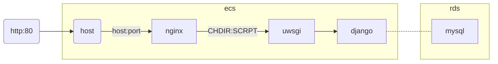

# 上云



## FILE

- etc
  - nginx
    - nginx.conf
- home
  - admin
  - blangeblue
    - blange
      - blange
        - wsgi.py
      - fund
    - uwsgi.ini

## linxu

```
mkdir 
apt-get install -y python3-pip
apt update
apt install nginx
```


## nginx

```
server{
                listen 80;
                server_name 120.77.40.158;
                location /{
                        include uwsgi_params;
                        uwsgi_pass 127.0.0.1:3031;
                        uwsgi_param UWSGI_SCRIPT myproject.wsgi ;
                        uwsgi_param UWSGI_CHDIR /home/admin/foobar/myproject/ ;
                }
        }
sudo nginx -t
sudo systemctl restart nginx
```

## uswgi.ini

```
[uwsgi]
socket = 127.0.0.1:3031
chdir = /home/admin/foobar/myproject/
wsgi-file = myproject/wsgi.py
processes = 4
threads = 2
stats = 127.0.0.1:9191
```

# cli

```python
pip3 install django
apt install git
https://www.cnblogs.com/ayseeing/p/3572582.html
```

```django
django-admin startproject cdc
django-admin startapp cdc
python manage.py runserver
```


# restapi：

## market

### :market_id`market`

- `GET markets/:market_id/update-html`:获取更新市场的html
- `PUT markets/:market_id`:更新市场

## space

### :sapce_id`space`

- `GET spaces/:space_id/update-html `:获取更新空间html
- `PUT spaces/:space_id`:更新空间

## fund_hold

### fund_holds`fund_holds`

- `GET fund_holds/list-html`:获取基金持有列表html
- `GET fund_holds/add-html`: 获取新增基金持有html
- `POST fund_holds`:新增基金持有

### :fund_hold_id`fund_hold`

- `GET fund_holds/:fund_hold_id/update-html`：获取更新基金持有html
- `PUT fund_holds/:fund_hold_id`：更新基金持有

#### trade

##### Trades`fund_hold_trades`

- `GET fund_holds/:fund_hold_id/trades/list-html`:获取基金持有的交易记录html
- `GET fund_holds/:fund_hold_id/trades/add-html`:获取新增基金持有的交易记录html
- `POST fund_holds/:fund_hold_id/trades`:新增基金持有的交易记录

##### :trade_id`fund_hold_trade`

- `GET fund_holds/:fund_hold_id/trades/:trade_id/update-html`:获取更新基金持有的交易记录html
- `PUT fund_holds/:fund_hold_id/trades/:trade_id`:更新基金持有的交易记录

## fund

### funds`funds`

- `GET funds/add-html`:获取新增基金html
- `GET funds/list-html`:获取基金列表html

- `GET funds/reptile`:爬虫更新基金数据
- `POST funds`:新增基金
# todo


