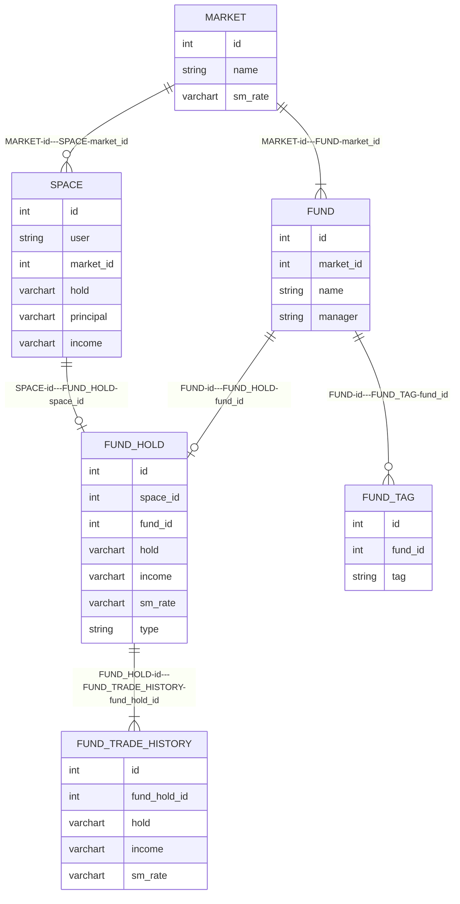
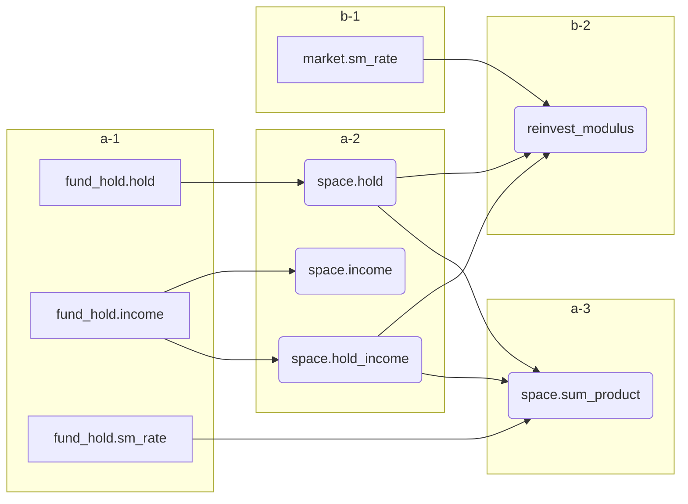

# 数据库设计




```mermaid
info
```

```mysql
select monitor.id as id ,monitor.fund_id as fund_id ,monitor.manager as manager,monitor.name as name,monitor.hold as hold ,monitor.income as income ,monitor.sm_rate as sm_rate ,monitor.type as type ,monitor.space_modulus as space_modulus,monitor.long_modulus as long_modulus, monitor.short_modulus as short_modulus ,
cast((monitor.space_modulus * monitor.long_modulus * monitor.short_modulus) * (    (monitor.reinvest + monitor.principal)     *    (1+ monitor.space_hold_income/monitor.space_income))/monitor.sum_product  as decimal(10,2)) as ideal_hold , cast((monitor.space_modulus * monitor.long_modulus * monitor.short_modulus) *    (case  when market.sm_rate < -0.15 then 0 else monitor.principal+monitor.reinvest end)/(monitor.sum_product*120 ) as decimal(10,2) )as day_invest
from (select fund_hold.id as id ,fund_hold.fund_id  as fund_id ,fund.manager as manager ,fund.name as name ,fund_hold.hold as hold ,fund_hold.income as income, round(fund_hold.sm_rate*100,2) as sm_rate,(case fund_hold.type when 'auto_invest' then '定投' when 'clearance' then '清仓' when 'price_invest' then '定价投' else '错误类型' end ) as type ,date_format(fund_hold.created,'%y-%m-%d %H:%i:%s') as created ,date_format(fund_hold.updated,'%y-%m-%d %H:%i:%s') as updated, (case when fund_hold.hold > (space.hold * 0.2) then 0 else cast((1 - (fund_hold.hold/space.hold )) as decimal(10,4)) end )as space_modulus ,(case when fund_hold.income < (-0.2*fund_hold.hold) then 0 else (fund_hold.income/fund_hold.hold +0.2) end) as long_modulus,(case when fund_hold.sm_rate > 0 then (fund_hold.sm_rate+0.2) else (case when (UNIX_TIMESTAMP(now())-UNIX_TIMESTAMP(fund_hold.created)) > 15768000 then 0 else(case when space.hold_income < 0 then 0 else cast(space.hold_income/space.hold as decimal(10,2) )end ) end  ) end) as short_modulus,space.sum_product as sum_product,reinvest_modulus*(space.income-space.hold_income) as reinvest ,space.principal as principal ,space.income as space_income,space.hold_income as space_hold_income, space.market_id as market_id from fund_hold   left join fund on fund.id = fund_hold.fund_id left join space on space.id = fund_hold.space_id  where space_id =2 order by fund_hold.hold desc) as monitor left join market on market.id = monitor.market_id 
```

```mysql
select 
sum(monitor.space_modulus * monitor.long_modulus * monitor.short_modulus)  as ideal_hold , cast((monitor.space_modulus * monitor.long_modulus * monitor.short_modulus) *    (case  when market.sm_rate < -0.15 then 0 else monitor.principal+monitor.reinvest end)/(monitor.sum_product*120 ) as decimal(10,2) )as day_invest
from (select fund_hold.id as id ,fund_hold.fund_id  as fund_id ,fund.manager as manager ,fund.name as name ,fund_hold.hold as hold ,fund_hold.income as income, round(fund_hold.sm_rate*100,2) as sm_rate,(case fund_hold.type when 'auto_invest' then '定投' when 'clearance' then '清仓' when 'price_invest' then '定价投' else '错误类型' end ) as type ,date_format(fund_hold.created,'%y-%m-%d %H:%i:%s') as created ,date_format(fund_hold.updated,'%y-%m-%d %H:%i:%s') as updated, (case when fund_hold.hold > (space.hold * 0.2) then 0 else cast((1 - (fund_hold.hold/space.hold )) as decimal(10,4)) end )as space_modulus ,(case when fund_hold.income < (-0.2*fund_hold.hold) then 0 else (fund_hold.income/fund_hold.hold +0.2) end) as long_modulus,(case when fund_hold.sm_rate > 0 then (fund_hold.sm_rate+0.2) else (case when (UNIX_TIMESTAMP(now())-UNIX_TIMESTAMP(fund_hold.created)) > 15768000 then 0 else(case when space.hold_income < 0 then 0 else cast(space.hold_income/space.hold as decimal(10,2) )end ) end  ) end) as short_modulus,space.sum_product as sum_product,reinvest_modulus*(space.income-space.hold_income) as reinvest ,space.principal as principal ,space.income as space_income,space.hold_income as space_hold_income, space.market_id as market_id from fund_hold   left join fund on fund.id = fund_hold.fund_id left join space on space.id = fund_hold.space_id  where space_id =2 order by fund_hold.hold desc) as monitor left join market on market.id = monitor.market_id 
```

```mysql
select sum(fund_hold.hold ) as hold ,fund_hold.space_id  as space_id 
                from fund_hold 
                group by fund_hold.space_id 
```

```mysql
select case when market.sm_rate < 0  or space.hold_income < 0 then 0 else (market.sm_rate * space.hold_income)/(space.hold*0.04) end as reinvest_modulus
from space
left join market on market.id = space.market_id
```

# 事务设计




